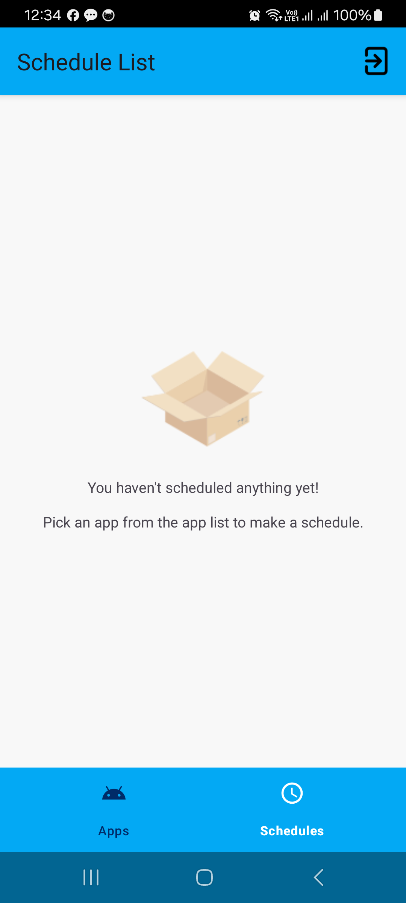

# App-Scheduler


<a href="https://www.flaticon.com/free-icons/schedule" title="schedule icons">Schedule icons created by feen</a>

## Overview
The **App Scheduler** is an app to schedule the launch of other installed applications. This project was made for MeldCX as a coding challenge.

### Key Features
- Fetches installed apps from the android system
- Schedules the launch of an app at a specific time
- Locally stores schedule info
- Allows to edit schedules that are still due to launch
- Reschedules all alarms after a reboot
- Launches scheduled apps even if app is killed or in the background
- Does not launch scheduled apps that are uninstalled

### Possible Upgrades
- Work on the UI
- Make QoL changes

### Tech stack
- [Kotlin](https://kotlinlang.org/)
- [Coroutines](https://github.com/Kotlin/kotlinx.coroutines)
- [Dagger-Hilt](https://developer.android.com/training/dependency-injection/hilt-android)
- [LiveData](https://developer.android.com/topic/libraries/architecture/livedata)
- [Lifecycle](https://developer.android.com/jetpack/androidx/releases/lifecycle) - Provides lifecyle event of an activity or fragment.
- [ViewModel](https://developer.android.com/topic/libraries/architecture/viewmodel) - Stores UI-related data that isn't destroyed on UI changes.
- [Navigation](https://developer.android.com/guide/navigation/navigation-getting-started)
- [View Binding](https://developer.android.com/topic/libraries/view-binding)
- [Room](https://developer.android.com/training/data-storage/room)
- [EncryptedSharedPreferences](https://developer.android.com/reference/androidx/security/crypto/EncryptedSharedPreferences)

## Screenshots
 
 
 


## Getting Started
These instructions will help you set up and run the project on your local machine for development and testing purposes.

### Prerequisites
- [Android Studio](https://developer.android.com/studio)
- Required [libraries](https://developer.android.com/studio/install#64bit-libs) for 64-bit Linux machines
- Android SDK
- Java 17

### Installation
1. Clone the repository by pasting the following command into your terminal:
```bash
   git clone git@github.com:sadman1148/App-Scheduler.git
```
2. Open the project in Android Studio and let it sync.
3. Connect a physical device or build a virtual device with the AVD manager.
4. Run the app.

### Usage
- Tap on any app from the apps list and pick a future time
- See scheduled apps in the schedule list
- Tap a schedule to reveal the edit/delete buttons
- Edit a schedule if required
- Delete a schedule if required


## Contribution
I welcome contributions from the community. To contribute to this project, follow these steps:

1. Fork this repository.
2. Create a new branch for your feature or bug fix: git checkout -b feature/your-feature-name
3. Make your changes and commit them: git commit -m 'Added a new feature'
4. Push to your branch: git push origin feature/your-feature-name
5. Create a pull request on this repository.


## Contact
Feel free to contact me on my [LinkedIn](https://www.linkedin.com/in/sadman-alam-impulse/) profile.
